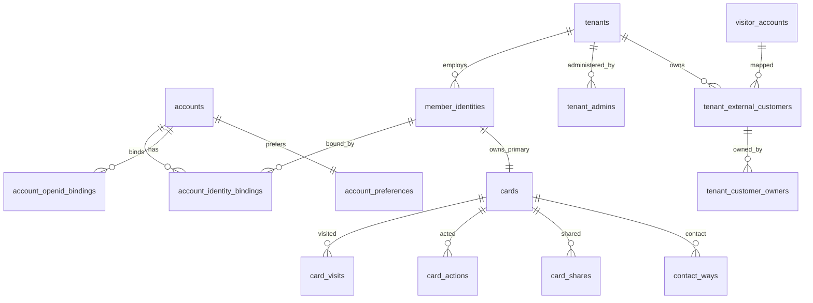

# 00_02 数据库 Schema（执行指引）

版本：v1.1 · 日期：2026-07-02 · 归属：后端 / DBA
关联主文档：[`00_01_Dev_Doc.md`](00_01_Dev_Doc.md) 的 §15（表定义 DDL）、§15.0（PostgreSQL 约定）、§15.2（通用字段）、§16.1（隔离）、§33.2（RLS 约定）
职责划分：**表结构 DDL 以主文档 §15 为准**（那里是 CREATE 语句事实源）；本文件是**迁移顺序、RLS 策略、ER、枚举取值、索引口径**的执行事实源。

---

## 1. 迁移顺序（按依赖，Prisma Migrate）

外键策略（审计 A4-P1-4，方案 A）：M1 对关键关系启用**复合外键**（父表先建 `(tenant_id, id)` 唯一键），防孤儿数据与跨租户错配；软删除用 `deleted_at`，FK 不做级联删除。流量上来后再评估是否拆除；若拆除必须补 invariant validator + CI 完整性测试 + orphan scanner + 后台健康检查（FK 清单见主文档 §15.4）。建表与初始化按逻辑依赖分批：

```text
批次1 基础：accounts, tenants, wecom_suite_state
批次2 身份：member_identities, account_identity_bindings, account_openid_bindings, account_preferences, tenant_admins
批次3 名片：cards, templates
批次4 访客/客户：visitor_accounts, tenant_external_customers, tenant_customer_owners
批次5 行为/分享：card_visits, card_actions, card_shares
批次6 联系我/许可/配额：contact_ways, contact_way_states, licenses, api_quota_counters
批次7 系统：audit_logs, callback_events, growth_leads, public_card_directory, admin_claim_tokens
批次8 §15.3/§15.4 变更：cards(public_id/card_type)、contact_ways(strategy/channel NOT NULL)、visitor_accounts(appid)、card_actions(share_id/visit_id/trust_level)、card_visits(share_id/visit_id/anon_id/trust_level，审计 A6-P1-1)、card_shares(issuer_type/issuer_visitor_account_id/depth，审计 A6-P1-2)、templates(uk_tpl_default_active，审计 A6-P2-4)、关键外键、软删除部分唯一索引 —— 若为全新库可并入建表。存量演进的 `ADD COLUMN ... NOT NULL` 须按「加可空列 → 回填 → SET NOT NULL」三步走（审计 A6-P2-7）
```

> 建议全新库直接以最终形态建表（含 §15.3 字段），批次8 仅用于存量演进。

## 2. 行级安全（RLS）

对**所有含 `tenant_id` 的表**启用 RLS，作为隔离第二道防线（§16.1）。

```sql
ALTER TABLE cards ENABLE ROW LEVEL SECURITY;
CREATE POLICY tenant_isolation ON cards
  USING (tenant_id = current_setting('app.tenant_id', true)::bigint);
  -- 统一带 missing_ok=true：无上下文时策略为假 → 查不到数据（拒绝），而非 SQL 报错（审计 A6-P2-3）
-- 对 member_identities / card_visits / card_actions / contact_ways /
-- tenant_external_customers / tenant_customer_owners / licenses / templates /
-- contact_way_states / card_shares / tenant_admins 同样启用同名策略（tenant_admins 见下，审计 A6-P1-3）
```

- 应用鉴权中间件在事务内 `SET LOCAL app.tenant_id = <当前租户>`；业务代码**禁止手写 `WHERE tenant_id`**（§16.1）。
- 平台级作业（跨租户运维）用**独立角色 + `BYPASSRLS`**，仅限审计通过的后台任务，默认应用角色不得 bypass。
- 无租户上下文的连接默认查不到任何租户数据（默认拒绝）。
- `audit_logs`、`api_quota_counters`、`growth_leads`、`callback_events`、`wecom_suite_state`、`accounts`、`admin_claim_tokens` 为平台/跨租户表，不启用租户 RLS，改由应用鉴权控制。
- **访客身份平台敏感表（审计 A7-P1-1）**：`visitor_accounts` 不含 `tenant_id`，但含 `wx_openid` / `wx_unionid` / 昵称头像，不能当普通平台表任意查。它只允许两类访问：当前访客上下文自查（如服务端会话绑定的 `visitor_account_id`）或平台脱敏运维；租户侧只能经 `tenant_external_customers`、`card_visits`、`card_actions` 的本租户关联视图读取必要投影，不得直接查询全局访客主档。
- **跨租户敏感绑定表（审计 A4-P0-2 / A7-P1-2）**：`account_identity_bindings` 记录「一人绑定多家企业身份」，**不能**笼统归为非 RLS 平台表。它启用 RLS 并支持两类上下文——租户上下文 `USING (tenant_id = current_setting('app.tenant_id', true)::bigint)` 与个人上下文 `USING (account_id = current_setting('app.account_id', true)::bigint)`；`account_preferences` 只允许 `account_id = current_setting('app.account_id', true)::bigint` 访问，租户管理员不得直接访问（策略见主文档 §15.4）。所有 `current_setting` 均带 `missing_ok=true`，缺上下文时默认拒绝而非 SQL 报错。
- **tenant_admins（审计 A6-P1-3）**：含 `tenant_id` 但此前既不在 RLS 清单也不在平台表清单，属隔离盲区，现纳入租户 RLS。登录时序：企业管理员企业微信 OAuth / 扫码返回 `corpid` → 先由 `tenants(open_corpid)` 定位 tenant → 事务内 `SET LOCAL app.tenant_id` → 再查 `tenant_admins(open_userid)` 建会话；即**登录查找始终有租户上下文**，无需跨租户按 open_userid 扫描（open_userid 本就按企业隔离，跨租户扫描无意义）。
- **公开目录表（审计 A4-P0-1）**：`public_card_directory` 是不含 PII 的全局解析表，**不启用租户 RLS**（公开访问开始时无 tenant 上下文）；public service role 只能查该表并执行公开读取流程，不给 `BYPASSRLS`、不得任意跨租户查业务表。

## 3. ER 概览



（多数关系为逻辑关系；其中 cards/card_visits/contact_ways 等**关键关系在 M1 用复合外键**落地，见 §1 与主文档 §15.4。一身份一主名片 = 部分唯一索引 `uk_cards_identity_type_active ON cards(member_identity_id, card_type) WHERE deleted_at IS NULL`。）

## 4. 枚举 / 状态取值目录

集中登记散落取值，避免各处口径不一（应用层用 Zod enum 作硬边界，§33.2）：

| 字段 | 取值 |
|------|------|
| `accounts.status` / `member_identities.status` / `cards.status` | `active` / `inactive` / `disabled` |
| `tenants.auth_status` | `active` / `changed` / `cancelled` |
| `member_identities.license_type` / `licenses.license_type` | `base` / `interflow` / `plan_basic` / `plan_wecom` / `plan_contact` |
| `cards.card_type` | `primary`（MVP）/ `recruiting` / `event` / `sales` |
| `contact_ways.strategy` | `per_member_static` / `per_campaign_static` / `temp_session` |
| `card_actions.trust_level` | `anonymous_client` / `session_verified` / `wecom_callback_verified` |
| `card_actions.action_type` | `save_phone` / `call_phone` / `copy_phone` / `copy_email` / `view_site` / `add_wecom` … |
| `callback_events.source` / `.status` | `command`/`data` ; `received`/`processing`/`done`/`failed` |
| `tenant_customer_owners.status` | `active` / `pending_transfer` |
| `growth_leads.status` | `new` / `contacted` / `converted` / `dropped` |
| `tenant_admins.role` | `owner` / `admin` / `operator` / `auditor` |
| `card_shares.issuer_type` | `member` / `visitor`（派生分享，审计 A6-P1-2） |
| `templates.scope` | `tenant` / `department`（平台预置模板以复制落地，无平台级行，审计 A6-P2-4） |

## 5. 索引与约束口径

- 可空列唯一：一律 `CREATE UNIQUE INDEX ... WHERE col IS NOT NULL`（unionid/open_userid/userid/external_userid/pending_id/visit_id），见 §15。
- 时间列 `created_at` 建普通索引用于范围查询（visits/actions/audit）。
- 热点：`card_visits`/`card_actions` 按 `(tenant_id, card_id)` + `created_at`；量大后按月分区（后续评估）。
- 通用字段 `deleted_at` / `created_by` / `updated_by` / UTC 时间：见 §15.2；软删除查询默认 `deleted_at IS NULL`。

## 6. 待核对

- Prisma 对 RLS 的 `SET LOCAL` 需在交互式事务/连接级注入，与连接池（PgBouncer transaction 模式）的兼容方式实现前验证。
- 是否对 `card_visits`/`card_actions` 采用分区表，依上线后写入量决定。
