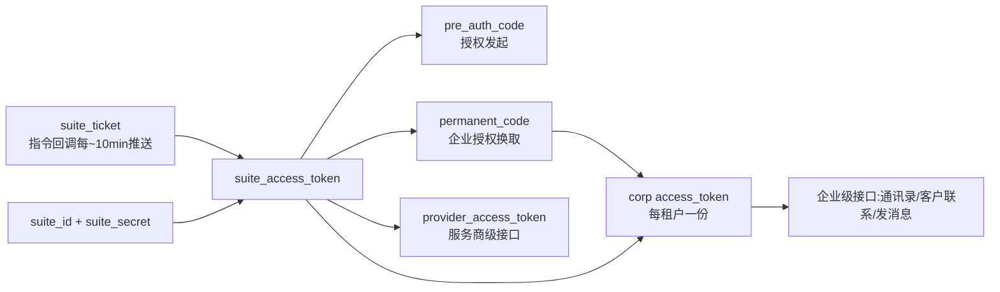
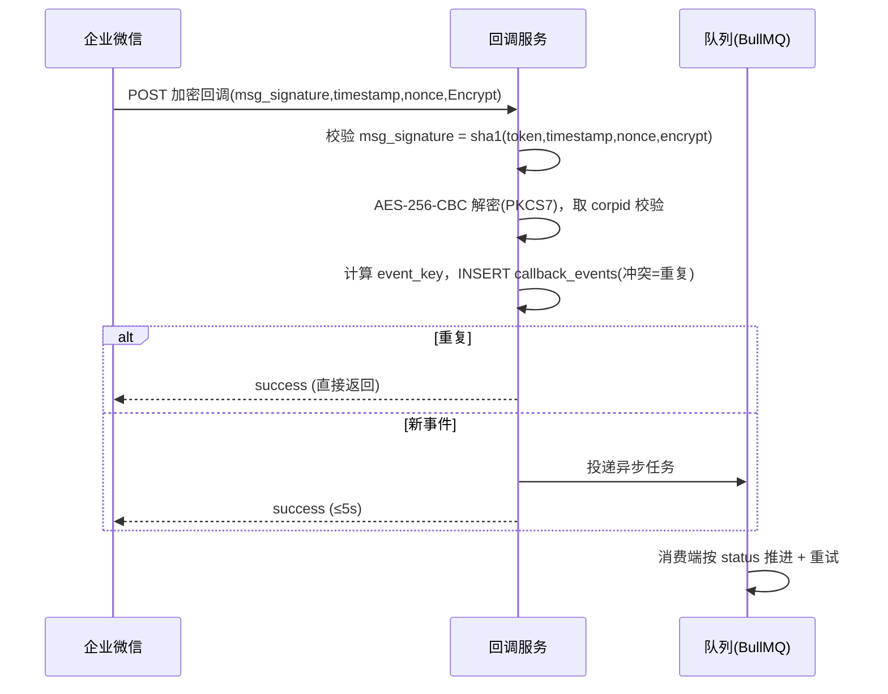
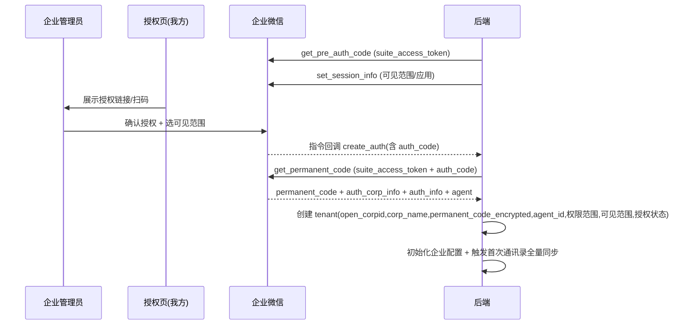
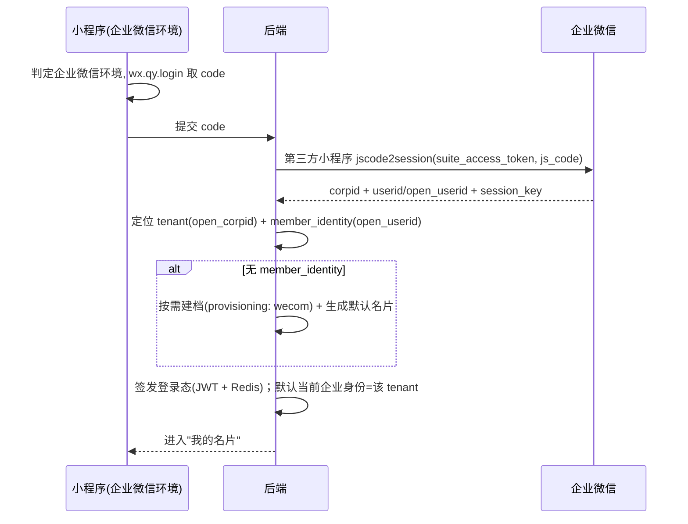
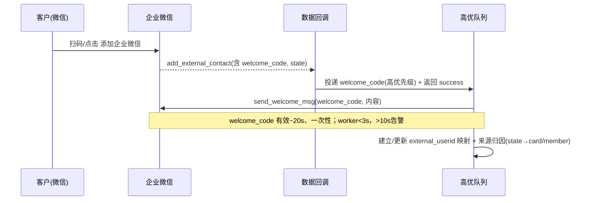

# 01_01 企业微信第三方应用对接（执行指引）

版本：v1.1 · 日期：2026-07-02 · 归属：企业微信对接组
关联主文档：[`../00-core/00_01_Dev_Doc.md`](../00-core/00_01_Dev_Doc.md) 的 §8 / §10 / §13.3 / §15.3 / §33.2
定位：本文件是**企业微信对接执行细节的事实源**；主文档只保留决策与指针，不复制此处正文。凡与企业微信官方最新文档冲突，以官方文档为准并回改本文件（见末尾「待核对」）。

---

## 0. 范围与目标

覆盖企业微信**第三方应用（服务商模式）**从接入到客户链路的全部服务端对接：凭据体系、双回调、企业授权、员工身份识别、通讯录同步、客户联系与 external_userid 映射、授权变更/取消。

对应里程碑：本指引的「授权 + wx.qy.login + 展示成功」属 **M1 闭环骨架**的企业微信部分；客户联系/映射属 **M3**；接入申请属 **M0 前置并行轨**。

不在本文范围：小程序端页面/分享（见将来 `01-specs` 小程序指引）、名片业务逻辑（主文档 §11/§13.4）。

---

## 1. 前置接入清单（M0，日历时间卡点）

以下均有审核周期，**第一天并行启动**，否则 M1 的企业微信部分被行政流程卡死。

- [ ] 企业微信**服务商**账号注册、主体认证。
- [ ] 创建**第三方应用**，获取 `SuiteID` / `SuiteSecret`。
- [ ] 微信**小程序**主体认证；类目适配；**与第三方应用关联**。
- [ ] ⚠️ 小程序与第三方应用置于**同一微信开放平台主体**下（否则 §8 unionid→external_userid 无法打通）。
- [ ] 配置**两个回调 URL**（各自独立 Token / EncodingAESKey）：
  - 指令回调 URL（套件级）
  - 数据回调 URL（企业级）
- [ ] 申请权限范围：通讯录读取、客户联系（互通）等。
- [ ] 服务器公网 HTTPS、业务域名、ICP/公安备案（按域名要求）。
- [ ] 锁定 1 家**试点企业**作为首个授权对象。

产出判据：拥有可授权的第三方应用 + 可用的双回调环境 + 一家待授权企业。

---

## 2. 凭据体系（一图看清依赖）

要点：**suite_ticket 是一切的起点**。拿不到最新 suite_ticket → 换不到 `suite_access_token` → 整条链断（主文档 §8.3）。

### 2.1 Redis Key 规划

| Key | 内容 | TTL 建议 | 刷新触发 |
|-----|------|----------|----------|
| `wecom:suite_ticket` | 最新 suite_ticket | > 30min 兜底 | 指令回调推送即写 |
| `wecom:suite_access_token` | suite_access_token | 按返回 expires_in | 剩余 1/5 有效期 |
| `wecom:provider_access_token` | provider_access_token | 同上 | 同上 |
| `wecom:corp:{corpid}:access_token` | 企业 access_token | 同上 | 同上 |
| `wecom:corp:{corpid}:jsapi_ticket` | jsapi_ticket | 同上 | 同上 |
| `wecom:lock:{type}:{corpid?}` | 刷新分布式锁 | 短 TTL | `SET NX PX` |

### 2.2 持久化（冷启动韧性，主文档 §15.3 `wecom_suite_state`）

最新 suite_ticket 与 suite_access_token 同时**加密落库** `wecom_suite_state`；冷启动先读库未过期值加载到 Redis，过期才进入等待并告警。**不要只放 Redis**。

---

## 3. 双回调架构（指令 vs 数据）

两个 URL、两套 Token/AESKey，**验签解密不可混用**（主文档 §8.1/§8.4）。

| | 指令回调（Command） | 数据回调（Data） |
|--|---------------------|------------------|
| 粒度 | 套件级 | 企业级（每租户消息） |
| 事件 | suite_ticket、create_auth、change_auth、cancel_auth | change_contact（create/update/delete_user、部门）、add/del_external_contact、欢迎语 |
| 凭据 | 指令回调 Token/AESKey | 数据回调 Token/AESKey |

### 3.1 收包处理（同步阶段 ≤5s）

- 加解密：统一封装 `wecom-crypto`（WXBizMsgCrypt：AES-256-CBC + PKCS7，`msg_signature=sha1(sort(token,timestamp,nonce,encrypt))`），主文档 §33.2。
- 幂等：`callback_events.event_key` 优先 `msg_id`，无则 `hash(corpid+event+changetype+ts+关键字段)`；`UNIQUE(event_key)`（主文档 §8.4）。
- URL 验证（GET echostr）：解密后原样返回明文 echostr。

---

## 4. 企业授权闭环（auth_code → permanent_code → tenant）

落库字段见主文档 §5.3 `tenants` + §8.2。`permanent_code` 必须 KMS 信封加密（§17.1）。

涉及接口（以官方文档为准）：`service/get_pre_auth_code`、`service/set_session_info`、`service/get_permanent_code`、`service/get_auth_info`。

当前落地入口：`POST /api/v1/wecom/authorization-links`。该接口由平台方使用 `x-wecom-launch-token` 发起，后端完成 `get_pre_auth_code` + `set_session_info` 后返回授权链接；真实试点企业打开该链接完成授权后，企业微信仍通过指令回调 `create_auth` 推送 `auth_code`，再由后端换取 `permanent_code`。

---

## 5. Token 获取与刷新

链路：`suite_ticket → suite_access_token → {pre_auth_code, permanent_code, corp access_token}`。

- 获取企业 access_token：`service/get_corp_token(suite_access_token, auth_corpid, permanent_code)`。
- **并发控制（§8.3）**：每个 `(corpid, token 类型)` 刷新前 `SET lock NX PX`；抢不到者读旧值/短暂重试。企业微信同类 token 并发刷新会互相失效，务必串行化（singleflight）。
- **提前刷新**：剩余 ≤1/5 有效期即刷；刷新失败保留旧值短时兜底并告警。
- **冷启动**：见 §2.2。

---

## 6. 员工身份识别（wx.qy.login）

- **主标识用 `open_userid`**（第三方应用常拿不到明文 userid），主文档 §5.4。
- 默认身份规则：从 A 企业微信打开就默认 A 企业身份，不被微信侧默认身份覆盖（§6.1）。
- access_token / session_key **绝不下发前端**（§8.3/§17.3）。
- 接口（以官方为准）：`service/miniprogram/jscode2session`。

---

## 7. 通讯录同步（主文档 §13.3）

- **权限依赖**：需通讯录读取范围；无权限时仅凭登录换取的 open_userid「按需建档」。
- **全量**：授权成功后拉一次（`user/list` / `user/get`，corp access_token）。
- **增量**：数据回调 `change_contact` 事件驱动。

| change_type | 处理 |
|-------------|------|
| create_user | 建 member_identity + 生成默认名片 |
| update_user | 更新资料（尊重字段编辑权限） |
| delete_user | 置离职、停用其名片、隐藏加企微入口、保留历史统计 |
| create/update/delete_party | 更新 `department_json` |

离职后 external_userid 归属按客户归属模型处理（`tenant_customer_owners`，§15.3），**不自动跨租户迁移**。

---

## 8. 客户联系与 external_userid 映射（M3）

### 8.1 联系我配置（禁止动态爆量，§9.1）

- 策略：`per_member_static`（默认，名片按钮）/ `per_campaign_static`（活动物料）/ `temp_session`（受配额限制）。
- `config_id` 必须持久化；active/未删除部分唯一索引 `uk_cw_static_member_channel_active(tenant_id, member_identity_id, strategy, channel)` 保证静态配置不重复生成，同时允许停用后重建（§15.3，审计 A7-P2-1）。
- `state` 用短 opaque token（`cwst_xxx`），不塞明文结构串（§9.2 / A3-8）。
- 接口：`externalcontact/add_contact_way` / `get_contact_way` / `update_contact_way`。

### 8.2 客户添加 + 欢迎语（§7.3）

welcome_code 约束（§7.3）：20s/一次性;管理端已配欢迎语则不返回 welcome_code(不发、记原因、不报错);发送幂等,失败记 errcode 不越窗重试。

### 8.3 unionid → external_userid 映射（§10）

**前置条件矩阵，缺一即恒失败**（M3 排期前逐项确认）：

| 前置 | 缺失降级 |
|------|----------|
| 企业已认证 | 隐藏加企微，仅基础名片 |
| 已开通/授权客户联系 | 同上 |
| 小程序与应用同一开放平台主体 | 只记 visitor_account，不映射 |
| 取到访客 unionid | 记 openid，待 unionid 到位重试 |
| 员工有互通/接口许可 | 隐藏该员工加企微 |

- 结果三态：`external_userid`（已是客户）/ `pending_id`（暂非，加企微后关联）/ 失败（仅记日志）。
- 存储 `tenant_external_customers`，按 `tenant_id` 隔离，`external_userid`/`pending_id` 部分唯一（§15）。
- **映射失败绝不阻塞客户查看名片/保存电话**。
- ⚠️ 入参可信性（审计 A6-P1-6）：`unionid` 一律取**服务端会话**（code2session 落 Redis 的结果），映射接口不接受客户端上送 unionid/openid——否则可伪造他人 unionid 污染 `tenant_external_customers` 归因。
- 接口：`externalcontact/unionid_to_external_userid`（需 corp access_token + 客户联系权限）。

---

## 9. 授权变更 / 取消授权

| 事件（指令回调） | 处理 |
|------------------|------|
| change_auth | 重新拉 `get_auth_info`，更新权限/可见范围；能力按新权限升降级 |
| cancel_auth | tenant 置取消授权、暂停企业微信增强能力；客户打开旧名片降级为基础只读（§30.4）；permanent_code 失效不再刷新 token |

---

## 10. 错误处理 / 重试 / 配额

- **配额 guard（§15.3 `api_quota_counters`）**：调企业微信接口前先过本地配额；接近阈值降级，不让客户链路报错。
- **限频/errcode**：`45009`/`45011` 等限频类走**指数退避**；`40014`/`42001`（token 失效/过期）触发强制刷新后重试一次。
- **回调重试**：`callback_events.status` + `retry_count` 驱动;超阈值进死信 + 告警。
- 所有企业微信调用统一封装：注入 token、自动刷新、错误码归一、埋点。

---

## 11. 安全

- `permanent_code` / `suite_secret` KMS 信封加密落库；企业 access_token 只缓存不落库（§17.1）。
- access_token / session_key / jsapi_ticket **绝不返回前端**。
- 回调各用各自 Token/AESKey 验签解密；校验 corpid 归属。
- 日志脱敏：access_token、permanent_code、external_userid 全量值不明文（§17.4）。

---

## 12. 测试清单（对齐主文档 §20.2）

- [ ] 指令回调 URL 验证（echostr）通过；错误签名被拒。
- [ ] suite_ticket 推送落 Redis + 落库；冷启动可从库恢复。
- [ ] suite_access_token / corp access_token 获取与提前刷新；并发刷新单飞不互踢。
- [ ] 企业授权：auth_code → permanent_code → 建 tenant → 首次全量同步。
- [ ] wx.qy.login：识别 open_userid、按需建档、自动默认名片、默认身份正确。
- [ ] change_contact 增量：create/update/delete_user、部门变更。
- [ ] add_external_contact：welcome_code 20s 内发送、幂等、已配欢迎语时不发。
- [ ] unionid→external_userid：三态 + 前置矩阵各缺失分支降级。
- [ ] 取消授权：能力暂停、旧名片降级只读。
- [ ] 回调幂等：重复推送只处理一次。
- [ ] 越权：A 租户 token 不能读 B 租户数据。

---

## 13. 任务拆分

### M0（前置并行轨）

- [ ] 服务商/第三方应用/小程序关联/双回调/权限申请（§1 清单）。
- [ ] 试点企业锁定。

### M1（闭环骨架 · 企业微信部分）

- [x] 回调服务骨架：双 URL、验签解密封装、`callback_events` 幂等表。
- [ ] suite_ticket 接收 + `wecom_suite_state` 持久化 + 冷启动恢复。
- [ ] Token 服务：链路获取 + 单飞刷新 + Redis/DB。
- [ ] 企业授权闭环 → 建 tenant → 初始化配置。
- [ ] wx.qy.login → jscode2session → member_identity + 默认名片。
- [ ] 首次通讯录全量同步 + create/update/delete_user 增量。
- [ ] 取消/变更授权处理。

### M3（客户联系增强）

- [ ] contact_way 策略化生成 + config_id 持久化。
- [ ] add_external_contact 回调 + welcome_code 高优发送。
- [ ] unionid→external_userid 映射 + 前置矩阵降级 + 来源归因。
- [ ] 配额 guard 接入。

---

## 附：接口速查（以企业微信官方最新文档为准）

| 用途 | 接口（cgi-bin 路径） |
|------|----------------------|
| suite_access_token | `service/get_suite_token` |
| 预授权码 | `service/get_pre_auth_code` |
| 设置授权配置 | `service/set_session_info` |
| 永久授权码 | `service/get_permanent_code` |
| 授权信息 | `service/get_auth_info` |
| 企业 access_token | `service/get_corp_token` |
| 第三方小程序登录 | `service/miniprogram/jscode2session` |
| 成员详情 | `user/get` / `user/list` |
| 联系我配置 | `externalcontact/add_contact_way` 等 |
| 发送欢迎语 | `externalcontact/send_welcome_msg` |
| unionid 转 external_userid | `externalcontact/unionid_to_external_userid` |

## 待核对（实现前对官方文档确认，确认后回改本文件）

> ⚠️ 审计 A4-P0-5 / A7-P1-4：以下分为 M1 前置与 M3 前置。`jscode2session` / `open_userid` / 可见范围是 **M0-M1 gate**，完成前 M1 企业微信部分不得开工；`unionid_to_external_userid`、`contact_way`、`welcome_msg` 是 **M0-M3 gate**，不得阻塞 M1 walking skeleton。

- 各接口精确入参/返回字段与最新版本。
- 第三方小程序 `jscode2session` 返回是否含 `open_userid`、`session_key` 有效期。
- M3 前确认：`unionid_to_external_userid` 对「同一开放平台主体」与客户联系权限的确切要求。
- M3 前确认：`contact_way` / `welcome_msg` 频率上限与限频错误码清单（补充 §10 退避策略）。
